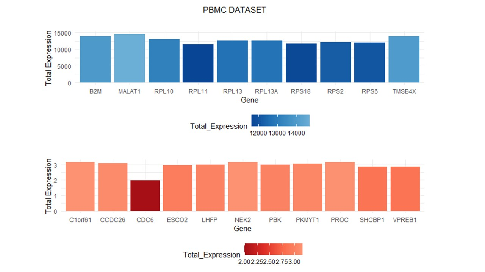

# Seurat -Guided Clustering Tutorial 
# Contents
- <span style="color: red;">[(1) Setup the Seurat Object](#section-1)</span>
- <span style="color: orange;">[(2) Standard pre-processing workflow](#section-2)</span>
- <span style="color: yellow;">[(3) Scaling the data](#section-3)</span>
- <span style="color: green;">[(4) Perform linear dimensional reduction](#section-4)</span>
- <span style="color: blue;">[(5) Determine the dimensionality of the dataset](#section-5)</span>
- <span style="color: indigo;">[(6) Cluster the cells](#section-6)</span>
- <span style="color: violet;">[(7) Run non-linear dimensional reduction (UMAP/tSNE)](#section-7)</span>
- <span style="color: purple;">[(8) Finding differentially expressed features (cluster biomarkers)](#section-8)</span>
- <span style="color: pink;">[(9) Assigning cell type identity to clusters](#section-9)</span>

## 1) Setup the Seurat Object 
The raw data was downloaded and extracted easily on a Linux machine but in Windows had to be extracted using the command ```tar -xvzf C:\PATH\TO\FILE\FILE-NAME.tar.gz -C C:\PATH\TO\FOLDER\EXTRACTION```.

The ```Read10X()``` function from 10X Genomics takes as input the ouptput of 10X cellranger and returns a UMI count matrix: a matrix that represents the number of molecules for each feature (meaning gene > row) that is detected in each cell (column). The count matrix is then used to create a ```Seurat object``` that stores raw and analysis data for a single cell dataset.

```R

# Loading dependencies into your R envirnoment : 

library(dplyr) # part of tidyverse contains functions for working with data frames 
library(Seurat) # package specifically for scRNA-seq
library(patchwork) # customizable layouts for plotting multiple graphs (ggplot2)

#  Load the dataset from saved location :

pbmc.data <-  Read10X(data.dir = "honours_2023/filtered_gene_bc_matrices/hg19/")
pbmc <- CreateSeuratObject(
counts=pbmc.data, # specifies the matrix of raw counts representing the gene expression data for each cell (row > gene, column > cell).
project='pbmc3k', # assign a project name or identifier to the Seurat objecT
min.cells=3, # specifies the minimum number of cells a gene must be detected in to be considered for inclusion in the analysis (FILTERS OUT GENES)
min.features=200 # sets the minimum number of features (genes) a cell must express to be considered for inclusion in the analysis (FILTERS OUT CELLS)
)

pbmc
# An object of class Seurat 
# 13714 features across 2700 samples within 1 assay 
# Active assay: RNA (13714 features, 0 variable features)

print(pbmc@assays)
# $RNA
# Assay data with 13714 features for 2700 cells
# First 10 features:
#   AL627309.1, AP006222.2, RP11-206L10.2, RP11-206L10.9, LINC00115, NOC2L, KLHL17, PLEKHN1,
# RP11-54O7.17, HES4

# The output indicates that the pbmc Seurat object contains an assay named "RNA" with # gene expression data for 13714 features (genes) across 2700 cells. The first 10 # feature names (genes) are listed in the output

rownames(pbmc)[1:5]
# interestingly not alphabetical 
# "AL627309.1"    "AP006222.2"    "RP11-206L10.2" "RP11-206L10.9" "LINC00115" 

pbmc.data[c("CD3D", "TCL1A", "MS4A1"), 1:30]
# viewing the data as a sparse matrix (dots save space)
# CD3D  4 . 10 . . 1 2 3 1 . . 2 7 1 . . 1 3 . 2  3 . . . . . 3 4 1 5
# TCL1A . .  . . . . . . 1 . . . . . . . . . . .  . 1 . . . . . . . .
# MS4A1 . 6  . . . . . . 1 1 1 . . . . . . . . . 36 1 2 . . 2 . . . .

pbmc.data[1:5, 1]
# viewing expression of first 5 genes in the first cell (when only one cell, no longer sparse matrix)
# MIR1302-10      FAM138A        OR4F5 RP11-34P13.7 RP11-34P13.8 
# 0            0            0            0            0

pbmc.data[c("CD3D"), 1:5]
# viewing the expression of one gene in first 5 cells : 
# AAACATACAACCAC-1 AAACATTGAGCTAC-1 AAACATTGATCAGC-1 AAACCGTGCTTCCG-1 AAACCGTGTATGCG-1 
# 4                0               10                0                0

```

## 2) Standard pre-processing workflow 

To explore the data more and answer questions like which genes are most highly expressed across all cell types, we need to first preprocess the data. 

The normalization process typically involves:

Library Size Normalization: Each cell's gene expression values are divided by the total count (library size) of that cell. This helps to account for differences in sequencing depth between cells.

Log Transformation: After library size normalization, the data is often log-transformed to stabilize the variance and make the distribution more symmetric. This is typically done using the natural logarithm (log2 or loge).

Scaling (Optional): While not part of the normalization process itself, it's common to scale the data after normalization. Scaling centers the data around zero and adjusts the variance, making the data suitable for downstream analyses such as dimensionality reduction and clustering.

After running NormalizeData(pbmc), the gene expression values in the Seurat object pbmc will be normalized and log-transformed, and you can continue with other analysis steps like identifying variable features, scaling, clustering, and visualization.

Remember that the specific normalization method and parameters might depend on the nature of your data and your analysis goals, so you should carefully consider these factors when working with scRNA-seq data.

```R
# 1: normalize 
pbmc.normalized <- NormalizeData(pbmc)
# Performing log-normalization
# 0%   10   20   30   40   50   60   70   80   90   100%
#   [----|----|----|----|----|----|----|----|----|----|
#      **************************************************|

pbmc.normalized <- FindVariableFeatures(pbmc.normalized)
# Variable features are genes that exhibit significant variability in expression across cells. Identifying these features is an important step in scRNA-seq analysis as it helps to focus subsequent analyses on genes that contribute the most to the heterogeneity between cells
# Calculating gene variances
# 0%   10   20   30   40   50   60   70   80   90   100%
#   [----|----|----|----|----|----|----|----|----|----|
#      **************************************************|
#      Calculating feature variances of standardized and clipped values
#    0%   10   20   30   40   50   60   70   80   90   100%
#      [----|----|----|----|----|----|----|----|----|----|
#         **************************************************|

pbmc.normalized <- ScaleData(pbmc.normalized)
# Centering and scaling data matrix
# |==============================================================================================| 100%


# looking at dimensions after normalization : 
print(pbmc.normalized@assays)
# interestingly the dimensions are the same as before normalization (normalization mainly adjusts the expression values of genes within each cell to make them comparable )
# $RNA
# Assay data with 13714 features for 2700 cells
# Top 10 variable features:
#   PPBP, S100A9, IGLL5, LYZ, GNLY, FTL, PF4, FTH1, FCER1A, GNG11


```

If we want to create a list of the most highly expressed genes : 

```R
# 2: calculate total gene expression for each gene across all cells:

total_expression <- rowSums(pbmc.normalized@assays$RNA)
# $ symbol : is used to access a specific component or column within a data structure
# pbmc.normalized@assays$RNA : extracts the column named "RNA" from the Seurat object pbmc.normalized
# rowSums(...) :  function calculates the sum of values along the rows of a matrix or data frame (total expression of each gene)
# assigns the calculated row sums (total gene expression values) to a new column named "total_expression" in the Seurat object
# FOR EXAMPLE : # CD3D  4 . 10 . . 1 2 3 1 . . 2 7 1 . . 1 3 . 2  3 . . . . . 3 4 1 5 <- row sum would calculate total expression of the CD3C gene

# To view this data we create a data frame : 
gene_names <- rownames(pbmc.normalized@assays$RNA) # making it easier to enter next command based on existing data set
total_expression_df <- data.frame(Gene = gene_names, Total_Expression = total_expression, row.names = NULL)
head(total_expression_df)
# Gene Total_Expression
# AL627309.1       AL627309.1        14.338887
# AP006222.2       AP006222.2         4.872586
# RP11-206L10.2 RP11-206L10.2         6.547301
# RP11-206L10.9 RP11-206L10.9         3.595927
# LINC00115         LINC00115        28.892876
# NOC2L                 NOC2L       427.861511

# Now that we have the total expression for each gene, we can sort the genes according to expression :
total_expression_ordered <- total_expression_df[order(-total_expression_df$Total_Expression), ] # Order the data frame by decreasing Total_Expression
head(total_expression_ordered) # check how high the highest expression is : 
# Gene Total_Expression
# 7855  MALAT1         14673.51
# 5541  TMSB4X         13986.50
# 9782     B2M         13919.49
# 5916   RPL10         13119.98
# 12957 RPL13A         12691.38
# 10710  RPL13         12683.03
tail(total_expression_ordered)# check how low the lowest expression is :
# Gene Total_Expression
# 6036     PBK         3.003175
# 9053    LHFP         2.999561
# 6035   ESCO2         2.950549
# 13272 VPREB1         2.876636
# 10430 SHCBP1         2.872113
# 11142   CDC6         1.996732
```
To practice, I tried plotting the top 10 highest and lowest expressed genes :</span>
```R


# Create a custom color palette for highly expressed genes
highly_expressed_palette <- colorRampPalette(c("#084594", "#2171b5", "#4292c6", "#6baed6"))

# Create a custom color palette for lowest expressed genes
lowest_expressed_palette <- colorRampPalette(c("#a50f15", "#de2d26", "#fb6a4a", "#fc9272"))

# Create the first facet plot for highly expressed genes
p1 <- ggplot(top_10_genes, aes(x = Gene, y = Total_Expression, fill = Total_Expression)) +
  geom_bar(stat = "identity") +
  scale_fill_gradientn(colors = highly_expressed_palette(10)) +
  labs(title = "",
       x = "Gene",
       y = "Total Expression") +
  theme_minimal() +
  theme(legend.position = "bottom",
        plot.title = element_text(hjust = 0.5))

# Create the second facet plot for lowest expressed genes
p2 <- ggplot(bottom_10_genes, aes(x = Gene, y = Total_Expression, fill = Total_Expression)) +
  geom_bar(stat = "identity") +
  scale_fill_gradientn(colors = lowest_expressed_palette(10)) +
  labs(title = "",
       x = "Gene",
       y = "Total Expression") +
  theme_minimal() +
  theme(legend.position = "bottom",
        plot.title = element_text(hjust = 0.5))

# Combine the facet plots into a single grid with titles and borders
combined_plot <- grid.arrange(p1, p2, ncol = 1, top = "PBMC DATASET")

# Add borders around each plot
bordered_combined_plot <- arrangeGrob(grobTree(rectGrob(), combined_plot), 
                                      heights = unit(c(0.5, 0.5), "null"))

# Print the final plot
print(bordered_combined_plot)
```



## 3) Scaling the data 

## 4) Perform linear dimensional reduction 

## 5) Determine the dimensionality of the dataset

## 6) Cluster the cells 

## 7) Run non-linear dimensional reduction (UMAP/tSNE)

## 8) Finding differentially expressed features (cluster biomarkers) 

## 9) Assigning cell type identity to clusters 
